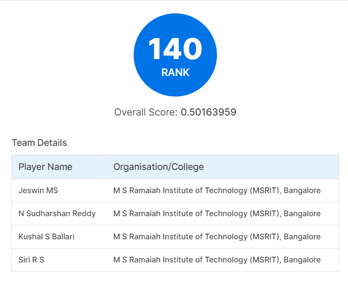

# Amazon ML Challenge 2024

Our team, **ThatOneUnstoppable**, secured the **140th rank** in the Amazon ML Challenge 2024, demonstrating strong capabilities in machine learning and data-driven problem solving.

  

## Problem Statement

The goal is to create a machine learning model that extracts entity values from images. This capability is crucial in fields like healthcare, e-commerce, and content moderation, where precise product information is vital. As digital marketplaces expand, many products lack detailed textual descriptions, making it essential to obtain key details directly from images. These images provide important information such as weight, volume, voltage, wattage, dimensions, and more, which are critical for digital stores.

## Dataset

1. **Index**: A unique identifier (ID) for the data sample.
2. **Image Link**: A public URL where the product image is available for download.  
   Example: [Sample Image](<https://m.media-amazon.com/images/I/71XfHPR36-L.jpg>)  
   To download images, use the `download_images` function from `src/utils.py`. See sample code in `src/test.ipynb`.
3. **Group ID**: Category code of the product.
4. **Entity Name**: Product entity name. For example: `item_weight`.
5. **Entity Value**: Product entity value. For example: `34 gram`.

## Processing Workflow

### 1. Text Extraction Using PaddleOCR and MiniCPM-V-2_6

We chose **PaddleOCR** for text extraction due to its superior prediction accuracy and faster inference times compared to other OCR techniques. PaddleOCR is proficient in handling various languages and complex layouts. Its efficient processing of large volumes of images allowed us to promptly extract text from the dataset.

For images where PaddleOCR misclassified or failed to capture the text, we used **openbmb/MiniCPM-V-2_6**, a large language model, to extract relevant units from the images. The VLM was only considered for incorrect OCR outputs to maintain efficient inference times.

### 2. Refinement with Advanced Regex Techniques

- **Identify and Extract Specific Values**: We isolated essential data such as height, width, depth, weight, volume, voltage, and wattage measurements using regex patterns tailored to match specific keywords and numeric values.
- **Clean and Format Data**: Regex helped remove unwanted characters and formatting inconsistencies in the extracted text, resulting in a more accurate and readable dataset.

### 3. Enhanced Extraction Strategies

- **Positional Extraction**: We used positional extraction techniques to capture specific values such as depth. For instance, we focused on extracting the third value in a sequence or values near known keywords (e.g., "depth", "net weight").
- **Keyword Detection**: Integrating keyword detection allowed us to filter irrelevant data and concentrate on important measurements.

### 4. Unit Conversion and Data Integration

- **Unit Conversion**: Extracted values were standardized by converting them into SI units.
- **Data Integration**: The converted data was integrated into a structured format, facilitating further analysis and tasks like vehicle movement analysis and categorization.

### 5. Iterative Refinement and Optimization

We continuously tested and refined our methods to address challenges and improve accuracy. This iterative approach involved adjusting regex patterns, fine-tuning extraction strategies, and evaluating results. We also considered developing different models to process various entities separately, improving extraction accuracy for specific data types like depth, height, or vehicle type.

## Notebooks and Code

## Entities and Notebooks

| Entity Name           | Notebook                                                                 |
|-----------------------|--------------------------------------------------------------------------|
| **Height**            | [test_height.ipynb](<https://colab.research.google.com/drive/1Hc1vO-L_PpurQ6r4K8cWcybGD6FuI60l>)                         |
| **Width**             | [test_width.ipynb](<https://colab.research.google.com/drive/1Yl-R3Ws5Gite-Vj6oircxJImXjjqWNAK>)                           |
| **Depth**             | [test_depth.ipynb](<https://colab.research.google.com/drive/1AImdOP0p6aE9RLMaWikO8PQaf0BF-ZwC?usp=sharing>)                           |
| **Weight**            | [test_weight.ipynb](<https://colab.research.google.com/drive/12jHBYxOvE2uJgjJjPj5msBdR-xyYRZ-6?usp=sharing>)             |
| **Weight Recommendation** | [test_rec_weight.ipynb](<https://colab.research.google.com/drive/12jHBYxOvE2uJgjJjPj5msBdR-xyYRZ-6?usp=sharing>)             |
| **Voltage**    | [test_voltage.ipynb](<https://colab.research.google.com/drive/1YnLwNDscWK0WYmicxtEjDoTW_PBzMlKQ?usp=sharing>)                 |
| **Volume**            | [test_volume.ipynb](<https://colab.research.google.com/drive/1tz9RcX2VH4ABSs2D2w2eEvAIULd2Dj2O?usp=sharing>)                         |
| **Wattage**      | [test_wattage.ipynb](<https://colab.research.google.com/drive/1QOTueQ7COKy8aE4TAH74AhpiCEiYUMdk?usp=sharing>)                 |

